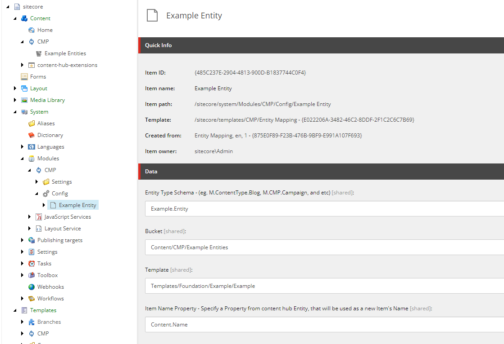
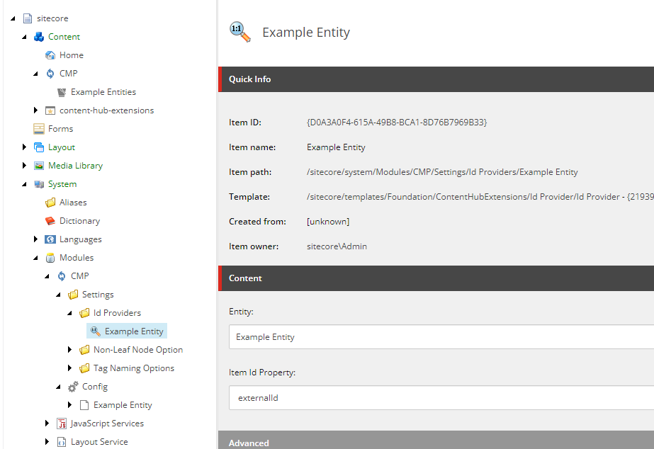

# Overview
This repository serves as a way to extend and enhance the out of the box Content Hub CMP Connector for Sitecore.

Features:
- Deterministic Item Ids
- Remove Solr Dependency


# How to use
Installing and configuring the module is straight forward. First, ensure you have the default CMP connector working on your Sitecore solution. Then, deserialize the Sitecore items in this solution into your Sitecore instance. Finally, configure the new features.

## Deserializing the included Sitecore items
This module uses Sitecore Content Serialization module included in the Sitecore CLI. If you want to directly install these new templates into your instance, run the following commands at the root of the repo:

```
dotnet tool restore
dotnet sitecore login --authority <https://id.hostname.com> --cm <https://cm.hostname.com> --alow-write true
dotnet sitecore ser push
```


## Configuring features
Some features are required for the module to work, and other are optional.

Required:
- Id Providers

### Id Providers (Deterministic Ids)
For deterministic Ids to work properly, and effectively remove the Solr dependency in the process, we must configure Id Providers inside of Sitecore.

To configure Id Providers, simple create your entity mappings like normal, and then create an Id Provider for that entity mapping under ```/sitecore/system/modules/cmp/settings/id providers```

Example CMP Entity Mapping:


Example CMP Id Provider:


